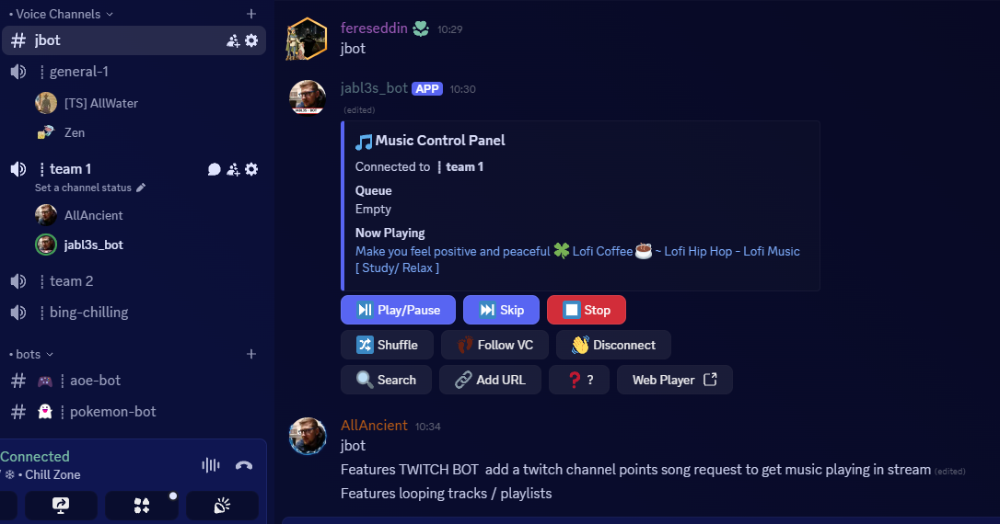

# Setup/installation and running mantainance guide  
  
1) Download the whole git repo with git clone or download as zip. (If downloaded as zip maybe extract it to your 'Documents' folder)  
  
2) REPLACE => .env file envs  
  2a ) Go to discord dev portal and create your application then sub the oauth2 secret key and client keys into the ```.env``` file  
  2b ) Go to youtube data api portal and create your application then sub the key into the ```.env``` file  
(N.B. if a default env is NONE when provided in param for functions a sub might be made in some places in python files...)  
(Tip: You can ignore the two 'redirect url' envs if you just want to use the discord chat model manager view without ever going to the flask webplayer view in your browser to control the bot and music playback)  
  
4) INSTALL DOCKER AND DOCKER-COMPOSE  
   (For bot to run and stop succesfully with ```docker-compose``` be sure to navigate to the correct path where you extracted the repository in command prompt i.e. cmd.exe or powershell, so if you extracted it to ```C:/User/Documents``` open command prompt or power shell with keybinds ```Win+R``` type ```cmd``` and then naviate to where you extracted the zip with:  
   ```cd C:/User/Documents/app1_dockercompose_jbot_armv7_discordbot_flaskmanager```)  
     
   3a. Now run bot with) ```docker-compose up -d```  
   3b. Or stop bot with) ```docker-compose down -v```  
     
Example dicord "chat model" manager view:  
  
  
Example flask webplayer manager view:  
    
