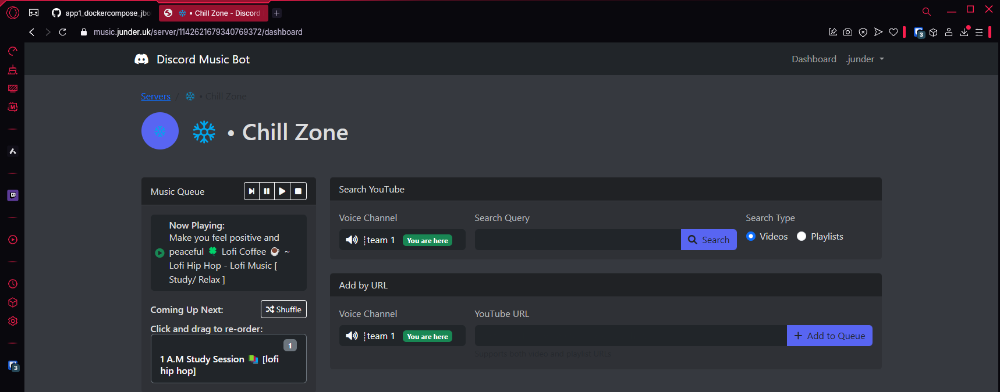

# Setup/installation and running mantainance guide  
  
1) Download the whole git repo with ```git clone``` or download as zip: https://github.com/junder-git/app1_dockercompose_armv7_discordbot_flaskmanager/archive/refs/heads/main.zip then extract zip to your users documents folder)  
  
2) REPLACE => ```.env``` file envs  
  - 2a ) Go to discord dev portal and create your application then sub the oauth2 secret key and client keys into the ```.env``` file: https://discord.com/developers  
  - 2b ) Go to youtube data api portal and create your application then sub the key into the ```.env``` file: https://developers.google.com/youtube/v3    
(N.B. if a default env is NONE when provided in param for functions a sub might be made in some places in python files...)  
(Tip: You can ignore the two 'redirect url' envs if you just want to use the discord chat model manager view without ever going to the flask webplayer view in your browser to control the bot and music playback)  
  
3) INSTALL DOCKER AND DOCKER-COMPOSE::: https://www.docker.com/products/docker-desktop/ => for windows  
   (For bot to run and stop succesfully with ```docker-compose``` be sure to navigate to the correct path where you extracted the repository in command prompt i.e. cmd.exe or powershell, so if you extracted it to ```C:/User/Documents``` open command prompt or power shell with keybinds ```Win+R``` type ```cmd``` and then naviate to where you extracted the zip with:  
   ```cd C:/User/Documents/app1_dockercompose_jbot_armv7_discordbot_flaskmanager```)  
     
   - 3a. Now run bot with) ```docker-compose up -d```  
   - 3b. Or stop bot with) ```docker-compose down -v```  
     
Example dicord "chat model" manager view:  
  
  
Example flask webplayer manager view:  
    
  
  
## Other notes  
  
RISK WIP - protect and make private the currently publicly accesible api flask endpoints cus i could use these urls to not be present in vc to manipulate the queue of other servers, to riterate 
FLASK needs semi protected endpoints to be accesible but private methods e.g. self_musicplaymethod() tro call its own private music player and endpoints, some reson i have two endpoints that could mrge into the if-elif-else block as well. However, discord api is running on the docker net so is only accesible by containers on it, np there      
 
  
Features TWITCH BOT  add a twitch channel points song request to get music playing in stream   
Features looping tracks / playlists  
Feature add the array of popular playlist urls to simply click on, upto 10playlists per server  
Security feature prevent large playlists with 100+ tracks being added only allow for a queue size of 50 as well as 1 instance of jbot per server limiter is gd enuff so far    
  
